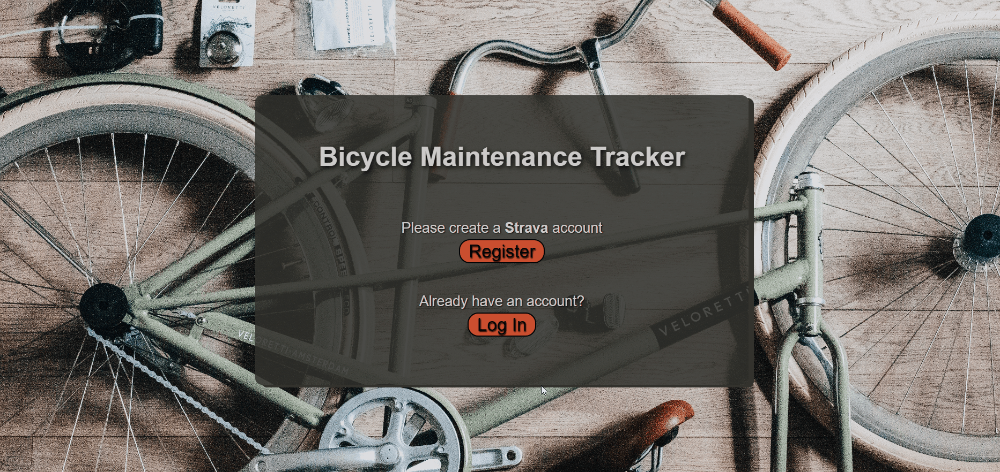
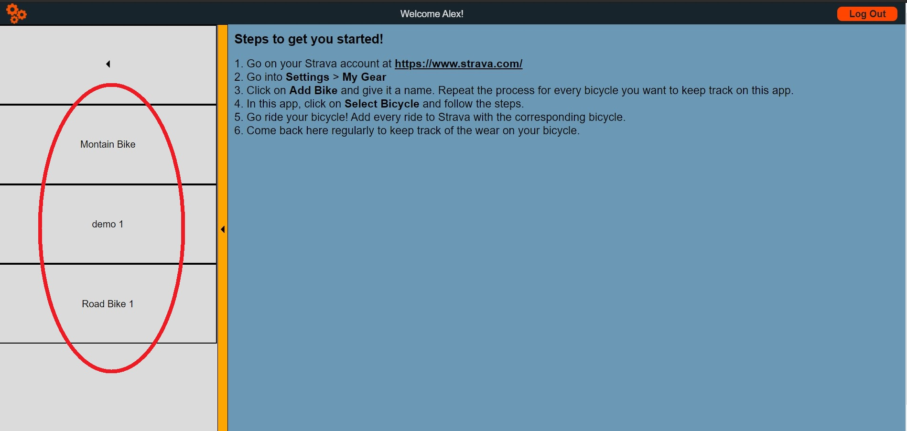
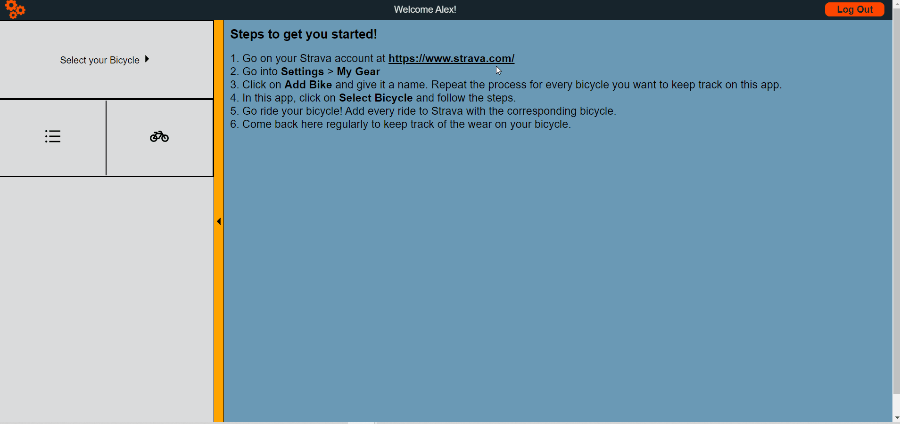

<h2>Bicycle Maintenance Tracker App</h2>

A web application tracking the wear of different bicycle parts on the user's bicycle(s) using the Strava API. It is built with React, MongoDB and Node.js. It served as my final projet for Concordia's Full Stack Web Developpment Bootcamp (Nov 2020 graduation).

Project Status: The project is currently under development. Specifically, the functionality of updating parts for different and animating the UI transitions.

<h2>Current features:</h2>

Log in through strava with Auth0:  

  

Choose bicycle from the user's collection: 

  

View parts navigation: 

  

Log Out through the app: 

  

<h2>Reflection:</h2>

This was my first sizeable coding project I have ever done. Even though there is more work to be sone, I consider it a resounding success. It turned out to be exactly what I set out to build.  

<h2>Functionalities currently implemented:</h2>
Authentication through Auth0 with the user's Strava account.
Let the user select a complete bicycle or build his own custom bicycle from a list of parts.
Use a database for the bicycle parts, bicycles, user's and user's data.
Render the bicycle's data as a list of parts or a bicycle diagram with color coded and clickable parts.
This beautiful README file.  

<h2>Unexpected obstacles:</h2>
Some strava user data can be set private. The authentication needs to be reflected that possibility.
The Strava API ha a limited number of calls per 15 minute window and per day.
The amount of data fetched from Strava can be overwhelming.
Tackling a project of this size with no plan of action leads to redoing certain sections as thing moves along.   

<h2>Learning opportunities: </h2>
Almost everything in this project was a first time for me. I had no clear plan of action which led me to do over certain sections of the project. For the next project, I will spend more time plannning.   

Getting the authentication to work for any Strava account was hands down the hardest part of the project. I learned how to use Auth0 and environnement variables. It also forced me to read a lot of API documentation. Luckily Strava did a decent job making them novice friendly. 

Building and styling the Front-End without a chosen theme or design was not the best course of action. It once again made me loose a lot of time rewriting a lot of code. For my next project I will use a tool like Figma or at the very least, choose a color theme.
